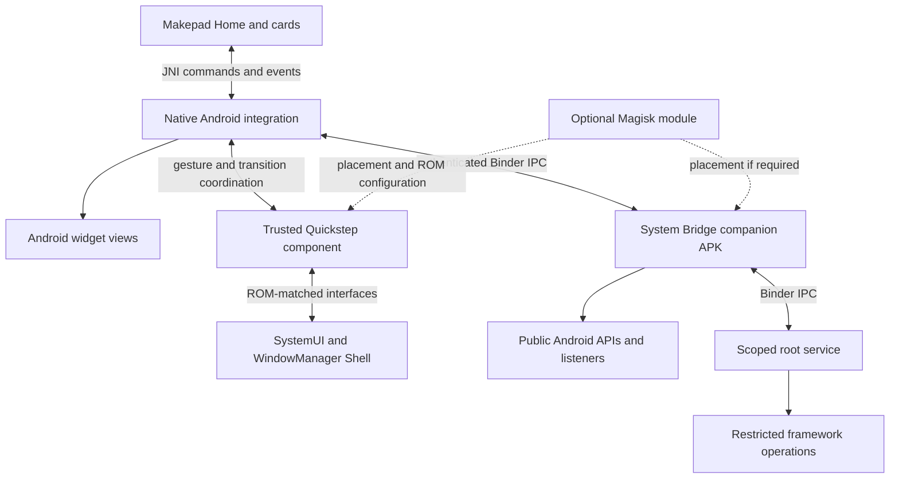

# ADR 0001: Hybrid Android launcher and system bridge

- **Date:** 2026-09-16
- **Status:** Accepted
- **Implementation status:** In progress; Home/bridge prototypes and the separate Quickstep layout-service prototype are installed on the approved OnePlus 6. Native API/Binder checks, Android/hosted icon placement storage/UI, public launch with the bridge service unavailable, activity/process recreation, package replacement/reconnection, widget pages, native Done input, current-user shortcut pin/icon/launch, synthetic notification label/icon rendering and cleanup have phone evidence. Home's visible-icon geometry is acknowledged across the authenticated service, with revision/invalidation and same-signer foreign-package rejection checks passing. The ROM-matched native Quickstep/Recents APK now compiles and passes packaging inspection; a deployment module is prepared. Native installation, app-to-Home transitions, broader lifecycle validation and performance parity remain pending; no milestone exit gate is complete. See the [implementation record](../android/adr-0001-implementation-record.md).
- **Scope:** OctoSense-mobile Android architecture; native-launcher parity and optional system controls
- **Initial target:** OnePlus 6, Android 15 / API 35, LineageOS 22.2

## Context

OctoSense provides a Makepad Home interface and hosted cards. Becoming Android's Home app supplies an entry point, but does not implement the system's Recents, gesture navigation or window-transition contracts. The inspected shade also uses demo notifications and local values for several device controls.

The objective is to match the built-in launcher's appearance, interaction, reliability and responsiveness while retaining OctoSense's interface. The initial reference is Trebuchet on the same OnePlus and ROM. A parity claim must identify its tested features and build; it cannot imply compatibility with every Android launcher or release.

The read-only device probe confirmed Magisk 29.0 and UID 0 access from ADB. SELinux was permissive and both SIM slots were absent. These results establish a development route, but do not validate a future helper's root grant, enforcing-mode compatibility, feature setters or SMS transmission.

This ROM reports `STATUS_BAR_SERVICE` and `MANAGE_ACTIVITY_TASKS` as `signature|recents`. Several other relevant permissions are signature-only. Privileged APK placement, platform signing, trusted Recents designation and root execution are distinct mechanisms; system placement alone cannot supply all required access. [Permission evidence and probe record](../android/system-integration-plan.md#5-privilege-boundaries-that-change-the-design), [AOSP privileged permissions](https://source.android.com/docs/core/permissions/perms-allowlist).

## Decision

Adopt a hybrid architecture:

1. **Makepad application:** renders Home, the app library, cards, notification presentation and OctoSense-owned animations. It runs with ordinary app privileges and uses public launcher APIs for the core experience.
2. **Native Android integration layer:** hosts Android widget views and coordinates lifecycle, input, keyboard, insets and Back. An optional trusted Quickstep component coordinates protected gestures, Recents and window transitions with SystemUI and WindowManager Shell.
3. **OctoSense System Bridge:** a companion APK exposes typed, authenticated Binder operations and state callbacks. Public APIs handle supported functions; a scoped root service handles operations that require elevated access.
4. **Optional Magisk module:** delivers system placement or ROM configuration only when a tested capability requires it. The root service can initially use MagiskSU without a deployment module.

The diagram defines responsibilities, not a guarantee that an ordinary helper can bind to protected services. The Quickstep component must satisfy the target ROM's configured Recents package, grant and SystemUI-binding requirements. The package layout below is the selected design; the prototype must verify that it can coordinate with the separate Makepad Home activity.

Prefer adapting ROM-matched Trebuchet/Launcher3 Quickstep components where feasible. Their activity, Recents view and state-model dependencies make this a refactoring project, not a drop-in service. [LineageOS Quickstep service](https://raw.githubusercontent.com/LineageOS/android_packages_apps_Trebuchet/lineage-22.2/quickstep/src/com/android/quickstep/TouchInteractionService.java), [animation manager](https://raw.githubusercontent.com/LineageOS/android_packages_apps_Trebuchet/lineage-22.2/quickstep/src/com/android/quickstep/TaskAnimationManager.java).

### Package and build layout

| Component | Location / identity | Ownership |
|---|---|---|
| Home application | Existing Rust crate; `dev.makepad.octosense` | Home role, Makepad interface, public launcher client and native widget views in the activity |
| Shared contracts | `android/contracts/`, Android library | Versioned AIDL interfaces and bounded parcelable models shared by the APKs |
| System Bridge | `android/system-bridge/`; `dev.makepad.octosense.bridge` | Ordinary services/listeners and a libsu root service; device controls, never gesture ownership |
| Quickstep extension | `android/quickstep/`; `dev.makepad.octosense.quickstep` | Native Recents activity, Quickstep service, gesture/transition controllers and external-Home adapter |
| Deployment module | `android/magisk/`, added when required | Target-ROM system placement, required allowlists and Recents configuration with rollback |

Use an Android Gradle build under `android/` for the contracts and two Android extension APKs. Keep the Makepad app's existing cargo-makepad build. Add opt-in app Java and generated-contract inclusion to its packager so the Home client and widget host are compiled, rather than relying on manifest declarations alone. Build/sign all three APKs with the same managed OctoSense development or release certificate; none is assumed to have the ROM's platform key.

For the Quickstep extension, configure the ROM's Recents component to the extension's native Recents activity, and separately expose its Quickstep service in that package. Ordinary Home remains the Makepad package. Preserve native Recents views/controllers for the initial implementation and bridge Home geometry to them; replacing the Recents renderer is a later decision. SystemUI binding, trusted Recents grants and the external-Home transition must all pass validation before enabling the extension.

Record the exact framework and Trebuchet source commits, build fingerprint, overlay/configuration changes and permission results for each supported adapter. A matching API level alone does not establish ROM compatibility. If the separate-package design cannot meet transition correctness or timing, record a superseding ADR before changing the package boundary; do not silently replace it with a root renderer or global SystemUI hooks.

### Versioned interface contract

The first contract major version is **1**. Use separate interfaces for device operations and native Home/Quickstep coordination:

| Interface | Required behavior |
|---|---|
| `ISystemBridge` | Protocol/capability handshake; initial state snapshot and subscriptions; explicit typed setters; notification actions; correlated completion callbacks |
| `IHomeIntegration` | Publish component/user icon bounds, display/orientation/insets and Home readiness; receive gesture/transition lifecycle events |
| Native Quickstep controllers | Own gesture sampling, animation targets, finish/cancel handling and surface cleanup; consume a cached Home layout for each transition |

Authenticate every binding and sensitive request by actual Binder UID, certificate and Android user. Keep framework Binder handles, notification `PendingIntent`/`RemoteInput` objects and privileged surface targets in the native layer; pass opaque, generation-scoped handles and necessary presentation data to Rust. Never expose arbitrary shell text or numeric Binder transaction calls to the UI.

Identify device commands by client session and command ID, state updates by bridge epoch and monotonically increasing revision, and transitions by transition ID and layout revision. Register a subscription with an initial snapshot and an ordered update boundary; after queue overflow or reconnection, request a new snapshot rather than applying incomplete deltas. Command completion is separate from observed state, and queues/backpressure must not discard a completion silently.

Return stable errors for denied access, unsupported operations, missing prerequisites, expired handles, incompatible protocol, disconnected helper, timeout and uncertain outcome. A timeout does not prove an operation was never applied. Reconcile setters with observed state; persist dispatch identity for SMS if messaging is added, and report an uncertain send without automatically repeating it.

Home layout updates are asynchronous and cached before a gesture. Native controllers receive input directly and update authorized surfaces on a frame-synchronized path. Makepad receives asynchronous progress/lifecycle events; there is no root command or synchronous cross-process acknowledgement for each frame. Geometry changes invalidate the cached layout. If geometry is unavailable or stale, use a validated generic Home transition and never animate toward a guessed icon position.

### Capability boundaries

| Responsibility | Android route | Intended result |
|---|---|---|
| Apps, profiles, shortcuts and icons | Public `LauncherApps`, Home role and applicable profile access | Real app discovery, package updates, launch and pinning |
| Widgets and wallpaper | Public `AppWidgetHost` / `AppWidgetHostView`, wallpaper APIs | Interactive native widgets and coordinated wallpaper behavior |
| Home gestures and quick switching | Trusted Quickstep, `IOverviewProxy`, input monitoring | Gesture ownership, swipe Home, hold for Recents and quick switch |
| Android Recents | Protected task services, task listeners and snapshots | Resume and dismiss real Android tasks with correct previews |
| App/window animations | Recents controllers, Shell transitions and granted `SurfaceControl` targets | App-to-icon transitions synchronized with Home |
| Predictive Back, split screen, PiP and unlock coordination | Public callbacks for OctoSense; authorized SystemUI/Shell interfaces for system coordination | Correct interaction with system navigation and window modes |
| Notification content and actions | Notification listener access, original action handles and `RemoteInput` | Real cards, dismissal, open actions and replies |
| Device controls and messaging | Public APIs where supported; explicit root adapters and SMS-role components where required | Observed device state, working controls and a separately scoped messaging implementation |

Public launcher and widget APIs remain the preferred routes for their features. [LauncherApps](https://developer.android.com/reference/android/content/pm/LauncherApps), [AppWidgetHost](https://developer.android.com/reference/android/appwidget/AppWidgetHost). Protected task operations require separate validation; their presence in Android's interface is not proof of access from OctoSense. [Android 15 task interface](https://raw.githubusercontent.com/aosp-mirror/platform_frameworks_base/android15-release/core/java/android/app/IActivityTaskManager.aidl).

### Graphics and communication

- Animate authorized app surfaces through Android's compositor and synchronize the Makepad Home layer. Static snapshots serve inactive Recents cards; continuous screenshot capture and texture upload is excluded from the transition path. Surface access and frame synchronization must be demonstrated. [SurfaceControl](https://developer.android.com/reference/android/view/SurfaceControl).
- Keep shell execution, synchronous Binder waits and service discovery off the Makepad render/input thread. Deliver bounded state events through Java/JNI; coalesce superseded state and slider writes.
- Use a frame-synchronized native path for gesture and surface animation. The discrete device-control channel must not require a shell command or synchronous IPC round trip for each frame.
- Return command acceptance, completion and observed state separately. Root denial, unsupported operations, expired notification actions and helper death are explicit states. Reconnect with a revisioned snapshot and avoid duplicate SMS sends after retries.

### Privilege and lifecycle

- Authenticate the bridge with a managed signing relationship and a signature-protected bound service. Verify actual caller UID, certificate and user at sensitive endpoints, including the root interface. Expose allowed operations rather than arbitrary shell execution.
- Use `libsu` for the bound root service. Pin its version and dependency hashes in the Android build. Its Binder support supplies a transport; individual Android operations still need permission, attribution, AppOps and SELinux verification. [libsu](https://github.com/topjohnwu/libsu).
- Advertise per-operation capabilities, prerequisites and validation status. Test the helper's own Magisk grant; ADB's grant is insufficient evidence.
- Keep ordinary Home and app launching usable when optional root or Quickstep extensions are unavailable. Handle process death, reboot, access revocation and extension upgrades.
- Validate enforcing SELinux compatibility. Any required policy change must be narrowly scoped; permissive mode is not an intended runtime dependency. [Android SELinux](https://source.android.com/docs/security/features/selinux).

### Compatibility and recovery

Capabilities distinguish API discovery, granted access and successfully validated behavior. The bridge can report root availability without claiming every root operation works. Protocol-major incompatibility or an unsupported ROM disables the affected extension while retaining public Home functions.

Before changing Recents configuration, retain the original component, affected overlay/module state and a recovery procedure. The initial module must support disable/removal and restoration to Trebuchet. Test missing APKs, boot failures and upgrades. Quickstep failure requires cancellation/cleanup of owned transitions and a tested restoration route; it must not leave a gesture monitor consuming input without a functioning controller. System Bridge failure marks controls unavailable and reconnects without affecting Home navigation.

Makepad Home and its native widget layer remain ordinary activity components with Android lifecycle handling. Notification listeners, receivers, bound helpers and root services retain their own lifecycle rules; do not use a permanent boot daemon or an `android:persistent` declaration as a blanket solution. Add startup persistence only for a demonstrated requirement.

### Scope boundaries

This decision covers launcher behavior, real notification presentation and a defined route to optional device controls. SystemUI/keyguard replacement, authentication changes, Zygisk hooks, arbitrary Android app embedding, vendor clock/charging tuning, a complete SMS/MMS/RCS client and an OctoSense ROM are separate work items. Their feasibility is not a prerequisite for the public launcher or the first Quickstep milestone.

## Alternatives considered

| Alternative | Assessment |
|---|---|
| Public-API Home app only | Provides the core launcher and remains the fallback. It does not supply complete system gesture/Recents transition control. |
| Root shell commands from the UI | Useful for isolated diagnostics and some setters, but insufficient for gesture/transition contracts and unsuitable on the render thread. |
| Mount the entire APK as privileged | Can supply eligible privileged permissions, but does not grant all signature/Recents permissions or implement native behavior. |
| Reimplement every gesture, task and transition controller in Rust | Keeps more logic in one language, but introduces substantial Android-version compatibility and cancellation/lifecycle work. Investigate reuse first. |
| Replace SystemUI/keyguard or ship an OctoSense ROM immediately | Can provide broader integration, but expands OS ownership and maintenance before launcher feasibility is established. Reconsider after a validated prototype. |

## Consequences

The architecture retains Makepad presentation while using Android's existing task, widget and window machinery. Optional elevated operations have a defined boundary, and the public core remains useful on ordinary devices.

It adds Android Java/Kotlin packaging, JNI/Binder interfaces, signing management and ROM-specific integration work. Native widget composition and Quickstep adaptation require prototypes. Manifest declarations require accompanying compiled components; the prototype packager now includes app Java and exported contract JARs.

Root does not itself improve frame pacing or remove Makepad shader, layout, allocation or scheduling costs. Existing rendering work remains necessary. Secure-content rules, profile isolation, app resize support and carrier provisioning remain feature constraints; root does not create missing hardware or network service.

## Implementation sequence

| Milestone | Deliverable | Exit evidence |
|---|---|---|
| M1: Public Home | Real app discovery/launching, shortcuts, icons, persistence, lifecycle and Android component packaging | Core Home works without the extensions through reboot, app changes and process recreation |
| M2: System Bridge | Contracts v1, authenticated binding, real state, notifications and supported public controls | Caller rejection, revocation, reconnect and root-denial cases pass; renderer remains responsive |
| M3: Quickstep prototype | ROM-matched package/module, one trusted binding and one real-app-to-Home transition using Home geometry | Required grants/binding, swipe/cancel/reverse, stale geometry fallback and module rollback pass |
| M4: Launcher parity | Native Recents, quick switch, supported Back coordination, widgets and wallpaper behavior | The functionality, reliability and performance gates below pass for the declared feature set |
| M5: Optional expansion | Split screen, PiP, unlock coordination and root network/power adapters | Each operation has a compatible adapter and a validation record; messaging is scoped separately |

M1 supplies the ordinary launcher release. M4 supplies the initial native-launcher parity claim for this target; passing only M3 or the interim rendering target is insufficient. Keep a dated validation record with APK/source hashes, ROM identity, capability results, scenarios and outstanding failures for every milestone.

## Validation and acceptance

- **Functionality:** app launch and Home return, swipe/hold, cancel/reverse, Recents resume/dismiss, quick switch, keyboard-visible navigation, rotation and lock/unlock behave correctly.
- **Public integrations:** shortcut pinning, widget configuration/resize/update, profile locking and package changes preserve correct identity and state.
- **Reliability:** reboot, activity/process recreation, helper death, root denial and permission revocation leave a usable core launcher and explicit feature states.
- **Performance:** use the gates below and the [performance plan](../android/performance-plan.md). Compare equivalent scenarios with Trebuchet, or native SystemUI for shade operations, on the same phone, ROM, refresh rate and controlled workload.
- **Privilege:** demonstrate the actual helper identity, Recents configuration/grants, SystemUI binding and enforcing-mode behavior. Command-help discovery is not setter validation.

### Performance gates for the initial target

These are selected acceptance thresholds, not measured results. Evaluate each scenario independently. Capture at least five valid runs per implementation for warm and fresh-process cases, alternate native and OctoSense runs to reduce drift, and report every valid run. Measure cold-install first use separately. Preserve input-to-first-visible-pixel timing and the active interval so idle frames cannot improve the score.

| Gate | Requirement |
|---|---|
| Interim rendering | Retain the existing target of at least 55 fps and p95 frame interval at or below 20 ms at 60 Hz; this alone does not establish native parity |
| Frame pacing parity | Across equivalent active spans, median per-run p95 and p99 frame intervals are each no more than 5% above the native reference; publish individual runs and maxima |
| Missed refreshes | Aggregate missed-refresh fraction is no more than 0.5 percentage points above the native reference; identify startup and mid-gesture misses separately |
| Response latency | p95 input-to-first-visible-pixel latency adds no more than one display refresh period over the native reference; any larger first-use stall remains a release blocker |
| Idle/recovery | No periodic render or shell activity introduced by the bridge after state settles; no sustained growth across repeated bind/unbind and transition cycles |
| Visual correctness | No regression in content, touch, focus, keyboard, profile isolation, cancellation or secure-content handling; pacing gains from missing content do not count |

Percentiles for short animations are sensitive to sample count. Publish raw traces and the aggregation method. If the native baseline is unstable, report the comparison as inconclusive and repeat controlled captures; do not loosen the thresholds after seeing the candidate results.

Feature readiness is reported separately from this accepted architectural decision. Prototype compilation is recorded separately from phone behavior. The milestone exit evidence, privilege checks and native-parity measurements remain outstanding.

## Related records

- [ADR 0001 implementation record](../android/adr-0001-implementation-record.md) — prototype source, approved tools, build evidence and remaining milestone work.
- [Android system integration plan](../android/system-integration-plan.md) — source evidence, device probe, API routes and detailed experiments.
- [Android launcher plan](../android/launcher-plan.md) — Home foundation and previous system-integration investigation.
- [Android performance plan](../android/performance-plan.md) — measurement requirements and rendering work.
