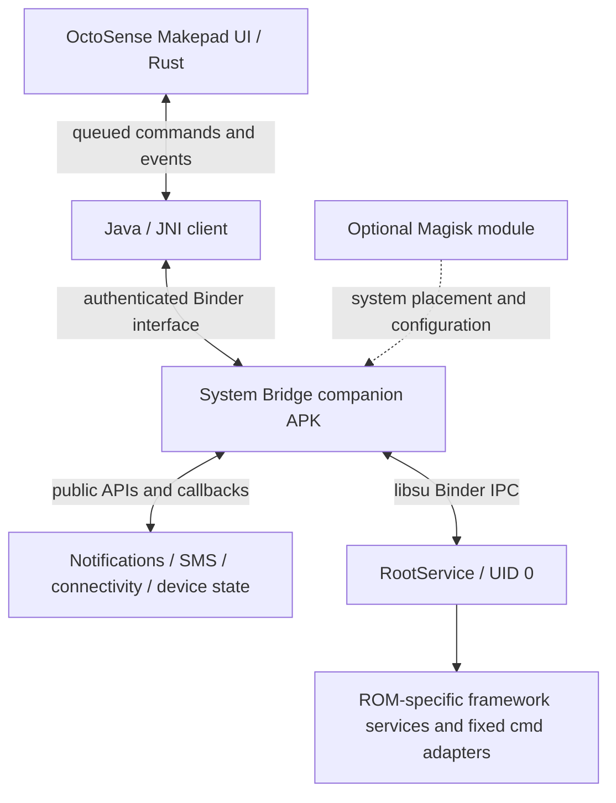

# OctoSense Android system integration

16 September 2026. Research and read-only device probe. The architecture is accepted in ADR 0001; implementation and device validation remain outstanding.

Architecture record: [ADR 0001: Hybrid Android launcher and system bridge](../adr/0001-hybrid-android-launcher-and-system-bridge.md). The ADR defines the selected package/interface contracts, recovery behavior and acceptance gates. This plan retains the detailed research and device evidence supporting that decision.

## Implementation direction

Build an **OctoSense System Bridge**: a companion Android APK with public Android services and a narrowly scoped root service. Keep the Makepad UI in its ordinary app process. Use asynchronous commands and state callbacks to connect the shade, messaging UI, and device controls to Android.

Use Magisk's existing root facility for the first version. Add a Magisk module only for a capability that demonstrably requires system-app placement, startup configuration, or ROM-specific changes. Replacing SystemUI or implementing Quickstep is a separate, much larger integration.

## 1. What is verified today

| Item | Read-only result |
|---|---|
| Phone | OnePlus 6 / ONEPLUS A6003, serial `cfb7c9e3`, authorized through ADB |
| Android | Android 15 / API 35, LineageOS `22.2-20260708-NIGHTLY-enchilada`, `userdebug` |
| Root | `su -c id` returns UID 0, SELinux context `u:r:magisk:s0` |
| Magisk | `29.0:MAGISK:R` |
| SELinux | **Permissive**; enforcing-mode compatibility has not been demonstrated |
| SIM | `ABSENT,ABSENT`; SMS transmission and mobile-data operation cannot be validated with this snapshot |
| Service command surfaces | Notification/DND, Wi-Fi, Bluetooth, power, network policy, connectivity, device idle, status bar |

Raw evidence: [`target/perf-artifacts/android-system-integration-probe-20260916.json`](../../target/perf-artifacts/android-system-integration-probe-20260916.json). This bench artifact is ignored by Git. It contains identity, command help, and permission protection flags, without message or notification contents. Several `cmd ... help` invocations return 255 while printing help; this is command discovery, not evidence that their setters succeed. No feature setter, role change, SMS send, APK installation, or system setting change was performed.

The ADB shell's root grant does not establish that a future bridge APK has a Magisk grant. Probe the helper's own process identity and permission results during implementation.

## 2. Where OctoSense stands

- [`src/mobile_shade.rs:134`](../../src/mobile_shade.rs#L134) flips local Wi-Fi, Bluetooth, torch, rotation, and DND booleans. Android is not called there.
- [`src/mobile_shade.rs:158`](../../src/mobile_shade.rs#L158) supplies demo notification cards. Its action handler dismisses a local card; action labels do not contain Android action handles.
- [`src/mobile_shade.rs:258`](../../src/mobile_shade.rs#L258) changes local brightness and volume values. Those values are not system controls.
- [`resources/android/AndroidManifest.xml.template`](../../resources/android/AndroidManifest.xml.template) registers Home and ordinary permissions, but no notification listener, SMS-role components, or bridge service. `POST_NOTIFICATIONS` covers posting notifications, not reading other apps' notifications.
- [`src/main.rs:4497`](../../src/main.rs#L4497) already receives `Event::HomeIntent`. The local Makepad framework queues Java-to-Rust messages in `platform/src/os/linux/android/android_jni.rs:956`; its `MakepadActivity.java:2511` can post OctoSense's own notifications. This is a useful transport pattern, not a system-control backend.
- `../makepad/tools/cargo_makepad/src/android/compile.rs:1128` compiles a fixed list of framework Java sources. The custom manifest hook exists at line 1030, but adding a manifest component alone does not compile its Java class. App-specific Java/AIDL source support is an explicit implementation task.

`Cargo.toml` now names Makepad revision `d4502ef1e4d196d2829a07aa137740cb0581e9b4`, with local workspace patches. The paths above describe the inspected workspace; resolve the actual release dependency graph before shipping bridge changes.

## 3. System Bridge process boundary



JNI connects Rust and Java. Binder is Android's cross-process messaging mechanism; AIDL defines a typed Binder interface. [`libsu`](https://github.com/topjohnwu/libsu) supports bound Java/Kotlin root services and Binder IPC, including native code. It is the selected root-service dependency and was not installed during this investigation.

**Selected layout:** an Android Gradle build under `android/` with `contracts/`, `system-bridge/` and `quickstep/` modules, as defined in ADR 0001. The System Bridge package is `dev.makepad.octosense.bridge`; it contains the libsu dependency and normal Android components. Add a small binding client and generic event transport to Makepad, and the feature state models to OctoSense. This avoids making the renderer's custom build tool package libsu and its transitive dependencies in the first iteration.

The helper and UI need a deliberately managed signing certificate. Protect the exported bound service with a custom `signature` permission and verify the actual Binder caller UID, certificate, and Android user. Validate callers at the root interface as well; authenticating only the initial bind is insufficient. Expose typed methods rather than arbitrary command execution.

Example contract:

```text
getCapabilities() -> bridge version, ROM/API identity, per-operation access and validation status
subscribeState(callback) -> initial snapshot followed by revisioned updates
setWifiEnabled(commandId, enabled)
setBluetoothEnabled(commandId, enabled)
setBrightness(commandId, normalizedValue, automaticModePolicy)
setBatterySaver(commandId, enabled)
dismissNotification(commandId, notificationHandle)
invokeNotificationAction(commandId, actionHandle, optionalReply)
listSubscriptions() -> subscription IDs and readiness
sendSms(commandId, subscriptionId, recipient, text)
```

Execute work on helper workers. Authenticate before deliberately clearing Binder calling identity for a delegated operation, where needed; check package/UID attribution and AppOps for each backend. Root is not a guarantee that every Binder endpoint accepts a request.

Return command acceptance, completion/error, and **observed system state** separately. A radio transition is pending until Android confirms it. Handle denied root, revoked notification access, expired actions, missing SIM, unsupported operations, and Binder death. Rebind and resynchronize snapshots after a helper restart. A retry must not duplicate an SMS send.

## 4. Feature routes

| Feature | Primary route | What root adds / what still needs verification |
|---|---|---|
| Notification cards, removal, snooze | Normal `NotificationListenerService`, enabled through notification access | Phone exposes `cmd notification allow_listener`; access, sensitive-content filtering, and profiles still need end-to-end tests |
| Notification open/actions/reply | Original `PendingIntent` and `RemoteInput` in the Java helper | Root is usually unnecessary; expired handles and lock-screen restrictions still apply |
| SMS send | `SmsManager`, `SEND_SMS`, explicit active subscription, sent/delivery callbacks | Root can support provisioning diagnostics and restricted telephony operations; it cannot supply a SIM or carrier service |
| Complete SMS/MMS inbox | Eligible default-SMS package, SMS/MMS receivers, Telephony provider, read/write permissions | Choose the package that owns the SMS role before implementing; do not edit the provider database directly |
| Network state | `ConnectivityManager` callbacks; Wi-Fi/Bluetooth state APIs with applicable permissions | Root diagnostics can add information; public callbacks should drive ordinary state updates |
| Wi-Fi/Bluetooth toggles | Root adapter on this modern Android target | Phone exposes `cmd wifi set-wifi-enabled` and `cmd bluetooth_manager enable/disable`; mutations are not tested |
| Mobile data / tethering | Subscription-aware telephony and tethering service adapters | Requires active SIM where applicable, hardware support, and entitlement handling; starting a Wi-Fi soft AP alone does not establish internet tethering |
| Data Saver / metered app policy | Network policy service | Phone exposes `cmd netpolicy`; these policies do not equal a general firewall |
| Per-app full network deny | Separate, ROM-specific networking adapter | Phone exposes connectivity package-networking commands; chain ownership, IPv4/IPv6, VPN paths, shared UIDs and uninstall/reinstall must be tested |
| Brightness / rotation | `Settings.System` with special write access; observe real settings and automatic brightness | Root can support restricted display/settings operations; distinguish a window-only brightness override from global brightness |
| Volume / torch | `AudioManager` and `CameraManager`, applicable permissions and callbacks | Start with public APIs; handle camera occupancy and audio/DND policy |
| DND | Public policy access and app-owned rules, or root global-DND adapter | Android 15 changes ordinary app behavior; phone exposes `cmd notification set_dnd` |
| Battery / charging / thermal state | Battery broadcasts and public power/thermal APIs | Callback-driven status does not need a continuously running root shell |
| Battery Saver / Doze policy / sleep / reboot | Root power/device-idle adapters, separately advertised capabilities | Help confirms saver/idle command surfaces; sleep/reboot require endpoint validation. Charging limits and clock controls are vendor/kernel-specific |
| Global shade / lock screen / Recents transitions | Target-ROM SystemUI/Quickstep integration | Root/module delivery alone does not implement these interfaces; preserve a working system UI while prototyping |

Public notification access supports posted/removed callbacks and cancellation/snooze. Keep notification identity as Android key plus user and a bridge generation, with opaque action handles retained in Java. Decode actual Android actions; a button label is insufficient. Process ongoing/non-dismissible notifications and grouping according to Android's observed result. Preserve content redaction and authentication requirements. [NotificationListenerService](https://developer.android.com/reference/android/service/notification/NotificationListenerService), [RemoteInput](https://developer.android.com/reference/android/app/RemoteInput).

For SMS, use `createForSubscriptionId` and observe subscription changes; do not silently use an arbitrary slot. Only the default SMS package receives the delivery intents and writes the SMS provider through the default-app route. Its required receiver, activity, and respond-via-message components belong to that same package. A companion can own the role and delegate presentation to OctoSense, or OctoSense can own it after its Android packaging supports those components. Ordinary send permission and a complete default-SMS client are different deliverables. [SmsManager](https://developer.android.com/reference/android/telephony/SmsManager), [Telephony](https://developer.android.com/reference/android/provider/Telephony), [SubscriptionManager](https://developer.android.com/reference/android/telephony/SubscriptionManager).

RCS remains a separate carrier/vendor/backend integration. Root and the SMS role do not provide Google Messages' RCS service or automatically satisfy the IMS single-registration requirements. See the [existing RCS feasibility analysis](../../../docs/octosense-android-rcs-feasibility.md) and [AOSP IMS requirements](https://source.android.com/docs/core/connect/ims-single-registration).

Modern app targets cannot simply call the old Wi-Fi and Bluetooth toggle methods: Android documents restrictions and system/device-owner exceptions. Build one adapter for this exact ROM before broadening support. [WifiManager](https://developer.android.com/reference/android/net/wifi/WifiManager#setWifiEnabled(boolean)), [BluetoothAdapter](https://developer.android.com/reference/android/bluetooth/BluetoothAdapter), [ConnectivityManager](https://developer.android.com/reference/android/net/ConnectivityManager).

For networking, do not take exclusive ownership of Android's `OEM_DENY_3` chain merely because a shell command exposes it. An implementation must coordinate with system policy and restore only changes it owns. For power and settings, validate automatic brightness, stream selection, and battery-saver state rather than treating a persisted setting as proof that the hardware changed. [Settings.System](https://developer.android.com/reference/android/provider/Settings.System), [PowerManager](https://developer.android.com/reference/android/os/PowerManager).

Apps targeting Android 15 generally control an app-associated DND rule through `setInterruptionFilter`, rather than the global filter. A global DND tile therefore needs a tested privileged/root route, and its state model must include other active rules. [NotificationManager](https://developer.android.com/reference/android/app/NotificationManager#setInterruptionFilter(int)).

## 5. Privilege boundaries that change the design

These are exact protection flags reported by this phone, not inferred from the fact that Trebuchet has a permission:

| Permission | Phone protection flags | Implication for a normally signed helper |
|---|---|---|
| `NETWORK_SETTINGS`, `NETWORK_STACK`, `MANAGE_NOTIFICATIONS`, `CONTROL_DISPLAY_BRIGHTNESS` | `signature` | Privileged-app placement and a privileged allowlist alone do not grant these |
| `STATUS_BAR_SERVICE`, `MANAGE_ACTIVITY_TASKS` | `signature\|recents` | Platform signature or trusted Recents integration; not a generic privileged-app grant |
| `DEVICE_POWER`, `RECEIVE_SENSITIVE_NOTIFICATIONS` | `signature\|role` | Requires the appropriate trusted role/signature route, or a separately validated delegated operation |
| `REBOOT`, `TETHER_PRIVILEGED`, `CONNECTIVITY_INTERNAL`, `BLUETOOTH_PRIVILEGED` | `signature\|privileged` | Privileged allowlisting is a possible route, with actual service checks still relevant |
| `WRITE_SECURE_SETTINGS` | `signature\|privileged\|development\|installer\|role` | Several grant routes exist; test the chosen one and its resulting access |

UID 0, Android's system UID 1000, a privileged APK, a platform-signed APK, and the configured Recents package are distinct identities. Running a root service does not change the renderer's identity. `pm grant` is not a blanket way to grant signature permissions.

A Magisk module can overlay an APK and configuration under a system partition. Privileged allowlists must match the APK's partition and only cover permissions with the applicable privileged grant path. For example, a `/system_ext/priv-app` helper needs its relevant `/system_ext/etc/permissions` configuration. Start without system placement unless the specific feature requires it. [Magisk module guide](https://topjohnwu.github.io/Magisk/guides.html), [AOSP permission allowlists](https://source.android.com/docs/core/permissions/perms-allowlist).

SELinux applies even to UID 0. This phone's permissive setting limits what the current probe proves. Validate the bridge on an enforcing target and, if necessary, define narrowly scoped, justified policy changes; permissive mode should not be a runtime dependency. Internal APIs also vary by release and may face non-SDK restrictions. Avoid fixed numeric `service call` transaction IDs; prefer public APIs or versioned adapters using matched framework interfaces and command surfaces. [AOSP SELinux](https://source.android.com/docs/security/features/selinux), [non-SDK restrictions](https://developer.android.com/guide/app-compatibility/restrictions-non-sdk-interfaces).

**Correction to the launcher probe:** its previous claim that all named Quickstep permissions were `signature|privileged` was incorrect for this phone. Changing `config_recentsComponentName` is not sufficient by itself. Android 15's SystemUI derives the package from that component, then resolves a `QUICKSTEP_SERVICE` within the package as a system service; the service is a separate component. Verify the ROM's Recents designation, grants, overlay policy, and contracts before changing it. [Android 15 OverviewProxyService](https://raw.githubusercontent.com/aosp-mirror/platform_frameworks_base/android15-release/packages/SystemUI/src/com/android/systemui/recents/OverviewProxyService.java).

## 6. Rendering and lifecycle contract

- No shell execution, synchronous Binder wait, or service discovery on the Makepad render/input thread. Java callbacks enter its message queue; Rust applies bounded state updates and requests redraw only when needed.
- Keep a root connection while privileged controls need it; avoid launching `su` for every tap or slider sample. Coalesce slider writes and commit the final value, with pending/observed state reconciliation.
- Observe connectivity, audio, settings, battery and notifications through listeners where possible. Do not poll `dumpsys` every frame. Avoid transferring large notification images or histories in a single Binder transaction; load bounded assets separately.
- On reconnect, accept one revisioned snapshot followed by deltas. Bound event queues and discard superseded state updates while retaining command completions.
- Test screen-off and process-death behavior. A public listener, SMS receiver, bound helper, root service, and boot-started module have different lifecycles; root alone does not make all ordinary APK components persistent.
- Measure shade dragging/open/close with the bridge enabled and under a notification burst against the same APK/device baseline. Record renderer frame time, helper CPU use, and command-to-observed-state latency separately.

## 7. Suggested implementation order and acceptance

1. **Transport and read-only state:** companion packaging, signing, authenticated binding, generic Java/JNI events, capability handshake, Wi-Fi/Bluetooth/battery/brightness/subscription snapshots. Demonstrate root in the helper itself, revoke it, kill/restart the helper, and resynchronize without blocking the UI.
2. **Real shade data and public controls:** notification posted/updated/removed events, dismissal, open and reply actions; volume, torch, brightness and rotation where public access permits. Remove Android demo fixtures. Test expired actions, non-dismissible cards, permission revocation and changes made outside OctoSense.
3. **Small root control set:** Wi-Fi, Bluetooth, global DND, Battery Saver. Test each setter on this ROM, observe the actual transition, and restore original state after each bench experiment. Label discovery-only capabilities distinctly from successfully validated operations.
4. **SMS:** settle role ownership and component packaging, then implement multipart send, incoming messages, provider reconciliation and sent/delivery results. Requires an active SIM for real transmission; test explicit slot selection, failures and process death without duplicate sends. MMS is a further transport/provider task.
5. **Deeper network/power functions:** mobile data, internet tethering, Data Saver and per-app deny, followed by idle policy and separately gated reboot/sleep. Add only operations whose ROM behavior, ownership and recovery are verified. Capability-gate vendor charging/clock controls.
6. **Optional system packaging:** introduce a reversible Magisk module only for proven placement/startup requirements. Verify reboot, module disable/removal, APK upgrades and enforcing SELinux. Quickstep/SystemUI replacement needs its own design and validation scope.

**First useful milestone:** an OctoSense shade that displays real notifications and real device state, invokes real actions, and controls Wi-Fi/Bluetooth/DND/Battery Saver asynchronously on this OnePlus. This establishes the bridge before undertaking a full messaging client or ROM UI replacement.

## 8. Further integration for native-launcher parity

Follow-up research, 16 September 2026. The user now prioritizes behaving like the built-in launcher. That makes Quickstep and the everyday launcher APIs more relevant than expanding SMS or power controls. The following are source-backed candidates, not capabilities validated in OctoSense on the phone. There is no single root API that supplies complete launcher parity.

### Protected integrations with the most visible benefit

| Priority | Android integration | User-visible result | Implementation boundary |
|---|---|---|---|
| 1 | Quickstep `TouchInteractionService`, `IOverviewProxy`, input monitoring | Swipe Home, swipe-and-hold Recents, bottom-edge quick switching, coordinated gesture ownership | A trusted, ROM-matched Quickstep component; a root shell toggle cannot implement the gesture state machine |
| 2 | `ActivityTaskManager` task listeners, recent tasks, task snapshots, launch-from-Recents and removal | Real installed Android apps appear in Recents, resume their existing tasks, and dismiss correctly | Protected task access, profile-aware identities, snapshot lifecycle and secure-content handling |
| 3 | Recents animation controllers and Shell remote transitions | App windows follow the gesture and finish at the correct Home/icon position | Native animation targets plus actual OctoSense icon bounds, cancellation/reversal and finish callbacks |
| 4 | `SurfaceControl` transactions on granted animation surfaces | Crop, move, scale and fade app surfaces together with launcher animation | Access comes from authorized window/animation integration; knowing the public class does not grant another app's surface |
| 5 | Shell `IBackAnimation` plus public Back callbacks for OctoSense itself | Predictive Back, including Back-to-Home coordination where the ROM supports it | Coordinate with Android's Back pipeline; handle the keyboard, cancellation, hosted cards and opted-out apps |
| 6 | Shell `ISplitScreen`, `IPip`, `IRecentTasks` | Split-screen actions in Recents and coordinated picture-in-picture transitions | Use system controllers and supported app behavior; do not assume every activity is resizeable |
| 7 | SystemUI state and unlock-animation interfaces | Correct behavior around lock/unlock, expanded shade, rotation and navigation-mode changes | Consume state from the trusted integration and respect authentication; replacing keyguard is a separate task |

LineageOS 22.2's `TouchInteractionService.onInitialize` receives SystemUI and Shell interfaces, including Back, PiP, split screen, recent tasks, transitions and unlock animation. Its input monitor is initialized against the current display and navigation mode. This gives a concrete reference for a ROM-matched adapter. [LineageOS TouchInteractionService](https://raw.githubusercontent.com/LineageOS/android_packages_apps_Trebuchet/lineage-22.2/quickstep/src/com/android/quickstep/TouchInteractionService.java), [Android input-monitor wrapper](https://raw.githubusercontent.com/aosp-mirror/platform_frameworks_base/android15-release/packages/SystemUI/shared/src/com/android/systemui/shared/system/InputMonitorCompat.java).

The task manager interface exposes task lists, stack listeners, snapshots, removal, and resume-from-Recents. The interface's existence does not establish access from our APK. [Android 15 task interface](https://raw.githubusercontent.com/aosp-mirror/platform_frameworks_base/android15-release/core/java/android/app/IActivityTaskManager.aidl). Trebuchet's animation manager handles target arrival, cancellation, completion and overlapping gestures; these details explain why matching the visible animation alone is insufficient. [LineageOS TaskAnimationManager](https://raw.githubusercontent.com/LineageOS/android_packages_apps_Trebuchet/lineage-22.2/quickstep/src/com/android/quickstep/TaskAnimationManager.java).

**Graphics recommendation, inferred from these interfaces:** animate the app's granted native surface through Android's compositor and synchronize the Makepad Home layer. Avoid continuously screenshotting an app and uploading it into a Makepad texture for the transition. Static task snapshots remain useful for inactive Recents cards. The integration must still prove surface lifetime, frame synchronization and the performance benefit on this phone. [SurfaceControl](https://developer.android.com/reference/android/view/SurfaceControl).

### Public integrations needed for the same experience

Root is optional for these routes, but they contribute substantially to everyday launcher behavior:

- **Installed apps, profiles and shortcuts:** use `LauncherApps` for component/user identities, icon data, package-change callbacks, launching and pinned/dynamic shortcuts. Handle pin-confirmation intents and verify shortcut-host access. Android 15 private-space support requires the appropriate Home role and hidden-profile access, plus locked-profile behavior. [LauncherApps](https://developer.android.com/reference/android/content/pm/LauncherApps).
- **Real Android widgets:** use `AppWidgetHost` and `AppWidgetHostView`, including binding, configuration, resize, updates and restore. Host native Android views alongside the Makepad surface as an implementation experiment; the native view hierarchy and touch handling are new work. Root alone does not render `RemoteViews` inside Makepad. [AppWidgetHost](https://developer.android.com/reference/android/appwidget/AppWidgetHost).
- **Wallpaper and theme:** use the live wallpaper behind the Home window, page offsets, wallpaper color callbacks and system theme resources. Public wallpaper coordination does not require repeatedly reading the wallpaper bitmap, which is restricted on recent Android. [WallpaperManager](https://developer.android.com/reference/android/app/WallpaperManager).
- **Icons:** honor adaptive icon layers/masks and monochrome themed-icon data when supplied, with a consistent fallback for older icons. [Adaptive icons](https://developer.android.com/develop/ui/compose/system/icon_design_adaptive).
- **Interaction details:** match system density/font scaling, insets, keyboard and Back handling, haptics and accessible focus. These require renderer/Android-view integration, not extra root grants. Public predictive-Back APIs cover OctoSense's own navigation. [Predictive Back](https://developer.android.com/guide/navigation/custom-back/predictive-back-gesture).

### Architecture and first experiment for this objective

Implement the **hybrid launcher** selected in ADR 0001: Makepad draws Home and OctoSense cards; a native Android layer hosts widgets and runs ROM-matched Quickstep/window-transition controllers; the System Bridge handles discrete device controls. Keep gesture and surface animation work on an appropriate frame-synchronized path. The ordinary asynchronous device-control command channel should not become a per-frame shell or round-trip IPC mechanism.

Prefer investigating reuse of LineageOS/Trebuchet Quickstep components before a fresh gesture/transition implementation. They depend on Launcher3's activity, Recents views and state model, so this is a refactoring feasibility project, not a drop-in service. Root/Magisk can deliver a prototype and ROM configuration; the exact Recents grants and SystemUI binding remain separate acceptance checks under Section 5.

For this priority, first complete real app discovery/launching, shortcuts, icons and lifecycle behavior. In parallel with that implementation, the next privileged experiment should establish one Quickstep binding and a real-app-to-Home transition coordinated with OctoSense. Verify swipe/cancel/reverse, Recents/resume, quick switch, keyboard-visible and lock/unlock cases against Trebuchet on the same device. Record gesture-to-display latency, missed frames and transition correctness before expanding to split screen or more system controls.

"100%" needs a defined target launcher and ROM version. Visual matching, Android behavior, accessibility, restart reliability and measured frame pacing are separate acceptance dimensions. Root supplies access and deployment options; shader, layout, allocation and frame-scheduling costs still need the existing performance work.
